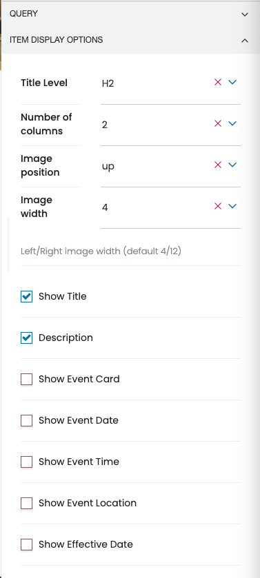
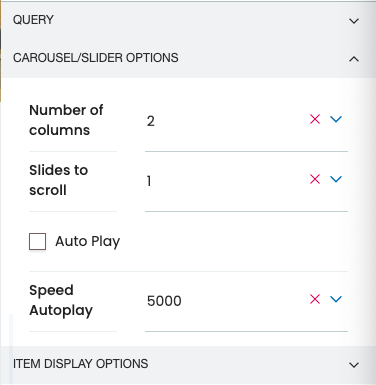

# volto-advanced-variations

A [Plone/volto](https://plone.org/why-plone) [block](https://6.dev-docs.plone.org/volto/blocks/index.html) [add-on](https://6.dev-docs.plone.org/volto/addons/index.html) that add two new variations to the listing and search blocks.
Based on codesyntax/volto-listingadvanced-variation this addon add events options including dates times and location, displaying this listing or search as a courusel, slider or image gallery.

## Advanced Listing properties

1. `titleTag` (_choice_): items heading level.
1. `howManyColumns` (_choice_): you can have one to four columns.
1. `imageSide` (_choice_): where the image will show, top, left, bottom, right background or no image.
1. `imageWidth` (_choice_): if the image shows left or right you can spacify the width within the item div.
1. `showTitle` (_boolean_): Show Title.
1. `showDescription` (_boolean_): Show Description.
1. `eventCard` (_boolean_): Show event card.
1. `eventDate` (_boolean_): Show event date.
2. `eventTime` (_boolean_): Show event time.
2. `eventLocation` (_boolean_): Show event location.
3. `effectiveDate` (_boolean_): Show effective date.

## Advanced Carousel properties

Carousel/Slider Options
1. `howManyColumns` (_choice_): you can have one to four columns.
1. `slidesToScroll` (_choice_): how many items to scroll at a time.
2. `autoPlay` (_boolean_): auto play the carousel.
3. `autoPlaySpeed` (_number_): auto play speed in milliseconds.

Item Display Options
2. `titleTag` (_choice_): items heading level.
1. `imageSide` (_choice_): where the image will show, top, left, bottom, right background or no image.
1. `showTitle` (_boolean_): Show Title.
1. `showDescription` (_boolean_): Show Description.
1. `eventCard` (_boolean_): Show event card.
1. `eventDate` (_boolean_): Show event date.
2. `eventTime` (_boolean_): Show event time.
2. `eventLocation` (_boolean_): Show event location.
3. `effectiveDate` (_boolean_): Show effective date.

## Example

